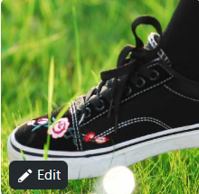

# Pigger操作手册（win10版）

concept  n.	概念; 观念;
例句：
The concept of childhood in western countries  西方国家的童年概念

# 讲座笔记

- 大连理工-宁
- 社交网络  车联网
- 车载社交网络 VSN Vehicular social network
- 边缘计算 分布式计算 深度学习 深度强化学习 模仿学习 弱监督 提供服务

